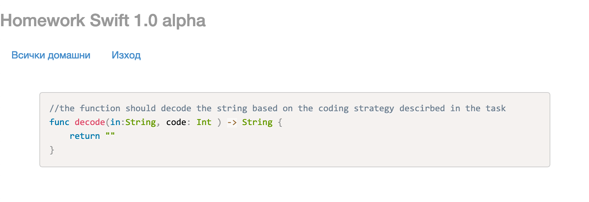

## Първото задание за самостоятелна домашна работа

Решениятo на всяка задача ще трябва да качите в нашия портал на следния адрес - [http://swiftfmi.apposestudio.com/](http://swiftfmi.apposestudio.com/register)

Всеки __ТРЯБВА__ да се регистрира с факултетния си номер.


За всяка задача, ще имате определена страница, където ще може да видите колко точки получавате.


Трябва да свалите шаблона и да попълните решението в него. Не оставяйте ненужни `print` извиквания във вашето решение. Системата няма да може да оцени некоректни решения и ще покаже съответната икона.



Ако имате някакви въпроси за системата, моля пишете на имейла за контакт.

Крайният срок за качване на решенията е _03.05.2020_!


## Задачи:

1. Да се напише функция, която отпечатва пълно обхождане на шахматна дъска с кон, без повторение от зададено начално поле. Шахматната дъска има размер 8 х 8.
Да се използва нотацията в шаха в матрица. Т.е. редовете са номерирани от `1` до `8`, а колоните от  `a` до `h`

Пример:

Ако коня започва от поле `а1` (долен ляв ъгъл), то следващото поле е или `b3`, или `c2`.


        func traverce(start: String) -> [String] {
        //всяко обходено поле трябва да е достижимо от предишното. Първото поле е началното. Едно поле не може да се срещата 2 пъти в отговора. Броя полета трябва да е 64.
		}

2. Да се нaпише функция, която пресмята стойността на прост математически израз от вида по-долу, подаден като `String` използвайки рекурсия:
	
	__Скобите ще са винаги налични и изразът ще е коректен!__
	
	Пример: 
		
		((23 + 6) * 2)
	
	Възможните операции са ```^(степенуване), *, /,  +, - ```.
	
		func evaluate(expression: String) -> Double {
			//TODO: your implementation goes here
		}

3. Да се напише функция, която намира броят на различните пътища в лабиринт, зададен в двумерен масив (матрица). Ако няма път, да връща ```0```.

	_Препоръчително е да се използват помощни функции и структури._
 
	Пример: 
		
		^ 0 0 0 0 0 0 1
		0 1 1 1 1 1 0 0
		0 0 0 0 0 1 # 1
		0 1 1 1 0 1 0 0
		0 1 0 1 0 0 0 1
		0 0 0 1 0 1 0 *
        
    Извикването на функцията, трябва да връща: 
    
           1

	Където:
	
		0 е проходимо поле
		1 е непроходимо поле
		^ е началната позиция
		* е крайната позиция
           # е непроходимо поле


	Примeрна функция:
                
            protocol Maze {
                init(raw: [[String]])
                ...
            }
            
            func findPaths(maze: [[String]]) -> Int {
			//TODO: your implementation goes here
		}

